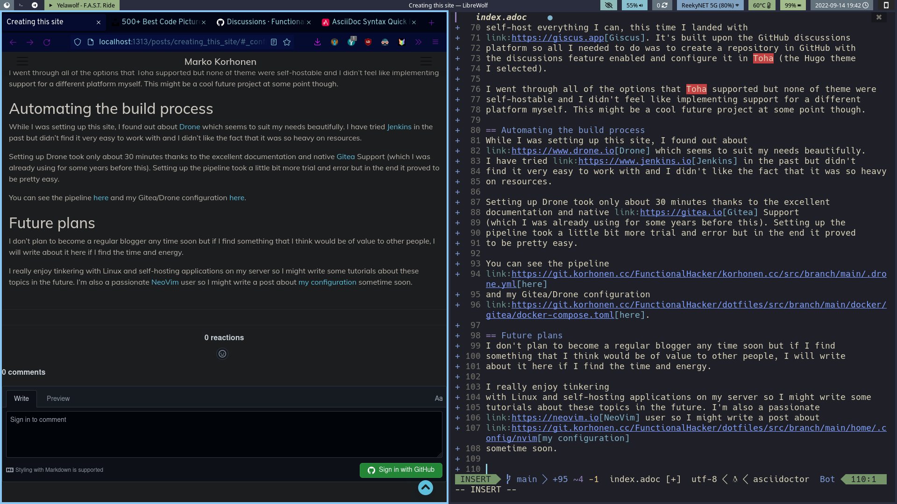

:toc:
= Creating this site
Marko Korhonen <marko@korhonen.cc>
v1.0, 2022-09-14

== Introduction
As seems to be customary on technology related blogs, the first post about
creating the blog itself. So here we are, this is the first post in my blog,
detailing the steps I took to arrive here.

== Assessing the options
I first got interested in static site generators years ago when my friend
Fatih built link:https://teaddict.net[his site] with
link:https://jekyllrb.com[Jekyll]. It felt very refreshing at the time
since I was hosting my homepage on WordPress, which always seemed a little
too bloated and overkill for my needs.

=== Jekyll
I tried setting up Jekyll multiple times during 2021 but got discouraged
by the build process which involved specifying all sorts of bundles and
gems for just for building my site (I never was very into Ruby to begin with).
I also got to debug all sorts of build problems which were a result of my
very specific requirements for the blog. I added multiple plugins which didn't
work together very well. The biggest hurdle to overcome was the fact that I
wanted to use link:https://en.wikipedia.org/wiki/AsciiDoc[AsciiDoc]
as the mark-up language and Jekyll doesn't natively support this so I had to
use a link:https://github.com/asciidoctor/jekyll-asciidoc[plugin] to bring
in the functionality. This plugin specifically didn't seem to work very well
with the other plugins I required and the theme I had selected.

Anyways, I never got further with setting up the site so I put the project
on the backburner. From the inception of the
link:https://korhonen.cc[korhonen.cc] domain in late 2020 until summer 2022
the main domain just showed a 404 error. I had a lot of self-hosted
applications only on subdomains.

=== Hugo
After discovering link:https://gohugo.io[Hugo] I got very exited immediately.
It seemed to be an answer to all of my problems. The main benefits were

* Single binary
* Support for AsciiDoc out of the box

Because of this, I got a basic site setup within a matter of minutes. No
more fiddling with bundles and gems. I also didn't require any other
plugins since Hugo seemed to support everything I wanted natively.

== Configuration
I opted to use the link:https://github.com/hossainemruz/toha[Hugo Toha] theme
for my site since it seemed to do well all of the things I wanted to
accomplish with this site

* A website where I can add any number of static pages (not blog posts)
** link:/pgp[Information page about my PGP key]
** link:/korhonen_aur[Information page about my Arch Linux repository]
* link:/[Introduction and portfolio]
* link:/posts[A blog]

The configuration of Hugo and the theme took quite a while but was well
worth it. I now have a beautiful multipurpose site which is easy to maintain
and expand.

=== Commenting system
I wanted to add support for users to add comments on the blog. While I usually
self-host everything I can, this time I landed with
link:https://giscus.app[Giscus]. It's built upon the GitHub discussions
platform so all I needed to do was to create a repository in GitHub with
the discussions feature enabled and configure it in Toha (the Hugo theme
I selected).

I went through all of the options that Toha supported but none of theme were
self-hostable and I didn't feel like implementing support for a different
platform myself. This might be a cool future project at some point though.

== Automating the build process
While I was setting up this site, I found out about
link:https://www.drone.io[Drone] which seems to suit my needs beautifully.
I have tried link:https://www.jenkins.io[Jenkins] in the past but didn't
find it very easy to work with and I didn't like the fact that it was so heavy
on resources.

Setting up Drone took only about 30 minutes thanks to the excellent
documentation and native link:https://gitea.io[Gitea] Support
(which I was already using for some years before this). Setting up the
pipeline took a little bit more trial and error but in the end it proved
to be pretty easy.

You can see the pipeline
link:https://git.korhonen.cc/FunctionalHacker/korhonen.cc/src/branch/main/.drone.yml[here]
and my Gitea/Drone configuration
link:https://git.korhonen.cc/FunctionalHacker/dotfiles/src/branch/main/docker/gitea/docker-compose.toml[here].

== Future plans
I don't plan to become a regular blogger any time soon but if I find
something that I think would be of value to other people, I will write
about it here if I find the time and energy.

I really enjoy tinkering
with Linux and self-hosting applications on my server so I might write some
tutorials about these topics in the future. I'm also a passionate
link:https://neovim.io[NeoVim] user so I might write a post about
link:https://git.korhonen.cc/FunctionalHacker/dotfiles/src/branch/main/home/.config/nvim[my configuration]
sometime soon.

Just for fun, here is a screenshot of me writing this blog post. How meta
of me 😃

.A screenshot of me writing a blog post about this blog

